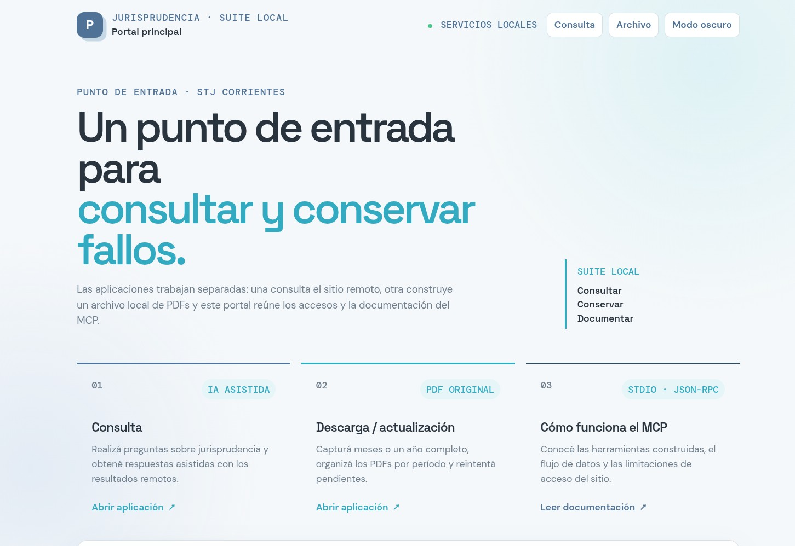
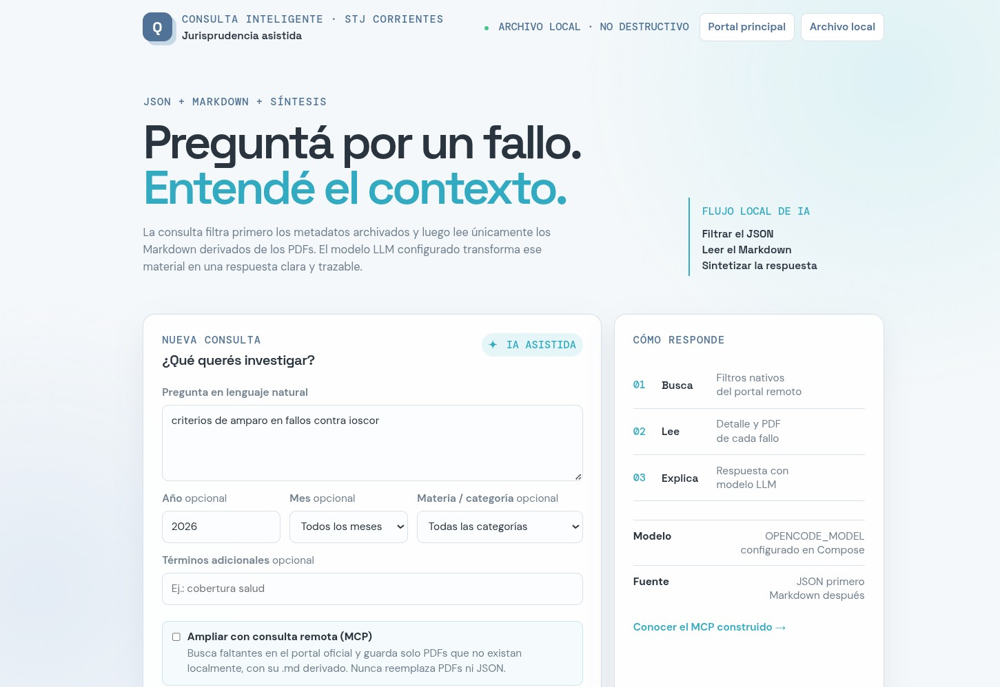
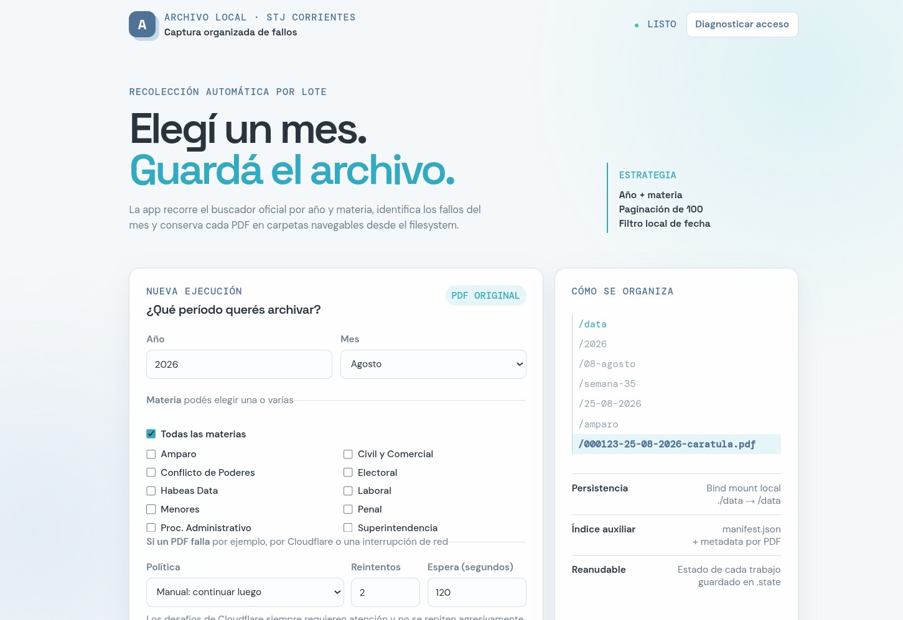
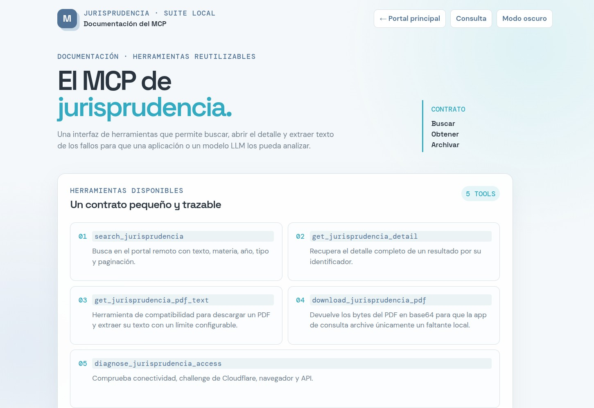

# Suite local de jurisprudencia · Corrientes

Suite de cuatro aplicaciones para consultar el portal remoto del Superior Tribunal de Justicia de Corrientes y conservar sus PDFs en un archivo local. El portal principal reúne los accesos; la app de consulta responde preguntas con el MCP; la app de descarga/actualización captura lotes; y el servidor MCP conserva la integración reutilizable.

## Aplicaciones y puertos

| Aplicación | Puerto | Función |
|---|---:|---|
| Archivo / descarga | 3000 | Captura mensual o anual, caché, reintentos y navegación de PDFs |
| Consulta | 3001 | Preguntas sobre el archivo local; MCP remoto opcional |
| Portal principal | 3002 | Acceso a las dos apps y documentación del MCP |
| MCP por stdio | — | Herramientas para clientes MCP/OpenCode |

Accesos locales:

- http://localhost:3002 — portal principal
- http://localhost:3001 — consulta
- http://localhost:3000 — descarga / actualización
- http://localhost:3002/mcp.html — explicación del MCP

Los tres servicios web usan network_mode: host para conservar el acceso al Chrome/CDP del host. Compose parametriza los puertos con ARCHIVE_PORT, QUERY_PORT y PORTAL_PORT, cuyos valores por defecto son 3000, 3001 y 3002.

## Capturas

### Consulta de jurisprudencia con IA

La interfaz de Consulta filtra primero el archivo local, lee los Markdown derivados y presenta una respuesta asistida por el modelo LLM configurado en Compose.



### Descarga y actualización del archivo

La aplicación de Descarga captura períodos mensuales o anuales, organiza los PDFs por año, mes, semana, fecha y materia, y conserva el estado para reintentos.



### Documentación del MCP

La página del MCP explica las herramientas construidas, el flujo entre el cliente, el servidor y el portal remoto, y las limitaciones de acceso de la fuente oficial.



## Criterio de búsqueda

El portal no ofrece un índice mensual ni fecha como filtro utilizable: las búsquedas textuales `MM-AAAA` y `DD-MM-AAAA` no devuelven los fallos que sí aparecen con `año + materia`. Por eso la app usa la capacidad compatible del sitio: paginación anual por materia, procesamiento secuencial página por página y filtro local por fecha. `Todo el año` mantiene ese recorrido único, evitando repetir doce veces la misma búsqueda anual. Cada ID o URL ya archivado se salta sin volver a descargarlo.

El acceso al portal reutiliza la lógica de la app anterior: HTTP directo cuando funciona y fallback a Chromium/Xvfb o a un Chrome externo por CDP cuando aparece Cloudflare.

## Persistencia local

Docker Compose usa un bind mount, no un volumen administrado por Docker:

```text
./data  →  /data
```

Ejemplo de estructura:

```text
data/
├── manifest.json
└── 2026/
    └── 08-agosto/
        └── semana-35/
            └── 25-08-2026/
                └── amparo/
                    ├── 000123-25-08-2026-caratula.pdf
                    └── 000123-25-08-2026-caratula.pdf.json
```

El PDF es el archivo principal. El JSON lateral conserva metadatos mínimos y `manifest.json` permite detectar la caché y alimentar una futura etapa de búsqueda local. El estado de trabajos queda en `data/.state/jobs/`.

## Arranque

Requisitos: Docker y Docker Compose.

```bash
cp .env.example .env
mkdir -p data
docker compose up -d --build
```

Para el acceso más confiable al portal, ejecutar antes el Chrome externo descrito en `scripts/start-host-chrome.sh` y usar en `.env`:

```dotenv
JURIS_ACCESS_MODE=browser
JURIS_CDP_URL=http://127.0.0.1:9222
```

Abrir http://localhost:3002. El directorio data pertenece al proyecto que ejecuta Compose y se puede recorrer manualmente desde el host. El cambio de puertos se aplica al crear o recrear los servicios; modificar docker-compose.yml no reinicia por sí solo un contenedor ya activo.

Al abrir la app de Consulta en http://localhost:3001, el panel “Preparación del acceso remoto” ejecuta automáticamente `GET /api/diagnose` y muestra por separado si Chrome/CDP y el portal de Corrientes están disponibles. La consulta one-shot local sigue habilitada aunque el diagnóstico esté cargando, falle o el portal remoto presente un desafío. Cuando Cloudflare bloquea el acceso, el panel despliega pasos en español para iniciar Chrome con CDP, completar el desafío manualmente y volver a revisar el estado; el botón “Copiar pasos” los copia al portapapeles.

## API de archivo / descarga

- `POST /api/jobs` inicia una captura: `{ "year": 2026, "month": 8, "materias": ["Amparo"] }`. `month: "all"` captura el año completo; un array vacío significa todas las materias.
- `GET /api/jobs` lista las últimas ejecuciones.
- `GET /api/jobs/:id` devuelve el progreso y el resultado de una ejecución.
- `POST /api/jobs/:id/retry` reintenta solo los pendientes de una ejecución anterior. Acepta `{ "retry": { "mode": "manual|automatic|delayed", "attempts": 2, "delayMs": 120000 } }`.
- `GET /api/archive/summary` devuelve totales de la caché.
- `GET /api/archive/documents?year=2026&month=8` lista PDFs archivados.
- `GET /api/archive/file?path=...` sirve un PDF ya guardado.
- `GET /api/health` y `GET /api/diagnose` informan el estado de la app y del acceso remoto.

Las capturas esperan por defecto 4 segundos entre búsquedas remotas consecutivas (`BATCH_SEARCH_DELAY_MS=4000`) para dejar que el banner anti-consultas rápidas del portal termine antes de pasar a otra categoría o página. Si el sitio no informa `totalPages`, la captura termina cuando recibe una página corta o una página repetida, evitando quedar consultando indefinidamente la primera página. `BATCH_DELAY_MS` conserva la pausa independiente entre descargas.

La app de consulta mantiene el endpoint compatible POST /api/query en el puerto 3001, con un cuerpo como { "question": "fallos sobre amparo", "searchText": "", "mode": "single", "includeRemote": false, "filters": {} }.

Después de cada consulta, la sección Material recuperado incorpora una columna lateral de Fuentes leídas. Allí se muestra el nombre y la ruta relativa de cada archivo utilizado por la respuesta, con accesos directos a su Markdown, al JSON de metadatos y al PDF original cuando están disponibles. Los accesos locales son `/api/local/markdown?path=...`, `/api/local/metadata?path=...` y `/api/local/file?path=...`.

## Consulta local y ampliación remota

La consulta trabaja por defecto en modo local y no destructivo respecto de los documentos originales. Lee primero data/manifest.json y los metadatos laterales .pdf.json, filtrando por año, mes y materia/categoría. Si un PDF seleccionado todavía no tiene su .md, genera un Markdown derivado una sola vez mediante pdftotext; nunca modifica el PDF ni el JSON. Luego la IA recibe exclusivamente los .md. El servicio monta la fuente archivada como solo lectura y dispone de una ruta separada para agregar únicamente esos derivados Markdown.

El checkbox Ampliar con consulta remota (MCP) agrega la búsqueda oficial y compara cada resultado por ID/fuente con el repositorio local. Solo para los faltantes solicita el PDF al MCP, lo guarda en la misma nomenclatura humana `año/mes/semana/fecha/materia/archivo.pdf` y crea su `.md` derivado. Nunca reemplaza un PDF, un JSON lateral ni `manifest.json`; el índice adicional `.query-archive.json` se usa para registrar capturas nuevas sin interferir con la aplicación de descarga. La IA recibe exclusivamente los Markdown locales. Si el sitio remoto o Cloudflare no están disponibles, la aplicación conserva la respuesta local y devuelve la advertencia, sin convertir la consulta local en un fallo.

La respuesta de la API incluye queryMode, nonDestructive, sourceReadOnly, derivedMarkdownOnly, derivedMarkdownCreated y sources.local/sources.remote para distinguir el origen de cada material. LOCAL_PDF_SCAN_LIMIT limita el escaneo de PDFs cuando no hay coincidencias en los metadatos.

## Captura de un año completo

La opción Todo el año no intenta enviar un filtro anual al sitio. El portal remoto no ofrece un índice mensual ni una fecha utilizable como filtro: las búsquedas textuales MM-AAAA y DD-MM-AAAA no devuelven los fallos que sí aparecen con año + materia. La app realiza una paginación anual única, procesa sus páginas en secuencia y filtra localmente por fecha/mes. Esto documenta una limitación del sitio, no un fallo de la aplicación.

## Desarrollo y pruebas

```bash
npm test
npm start
```

public-query/ contiene la interfaz separada de consultas, portal/ contiene el portal principal y src/portal-server.mjs sirve su documentación. src/server.mjs sigue exponiendo el MCP por stdio para clientes compatibles.

### Reintentos

Los errores transitorios de red o descarga pueden reintentarse automáticamente. La política `delayed` permite esperar, por ejemplo, dos minutos entre intentos. Un desafío de Cloudflare no se reintenta agresivamente: el trabajo queda como `needs_attention`, conserva sus pendientes y ofrece reintentar solo esos elementos después de resolver el acceso en el navegador/CDP. `manual` deja los fallos para continuar más tarde.

El archivo no interpreta ni resume el contenido jurídico. Los PDFs se guardan para una etapa posterior de conversión, indexación y búsqueda local.

## MCP

El MCP se implementa en src/server.mjs y ofrece search_jurisprudencia, get_jurisprudencia_detail, get_jurisprudencia_pdf_text, download_jurisprudencia_pdf y diagnose_jurisprudencia_access. La herramienta binaria se usa únicamente desde el checkbox remoto, después de verificar que el ID/fuente no esté archivado localmente. La página http://localhost:3002/mcp.html resume el contrato y el flujo. El modelo usado por la app de consulta se preconfigura en Compose mediante OPENCODE_MODEL, por defecto opencode/nemotron-3.5-lightning-free.

## Publicación

Después de revisar los cambios:

    git add README.md public-query portal src docker-compose.yml Dockerfile package.json test
    git commit -m "describir el cambio"
    git push origin main

El directorio local `data/` se mantiene fuera de los commits: contiene la caché de PDFs y Markdown generados en cada instalación.
