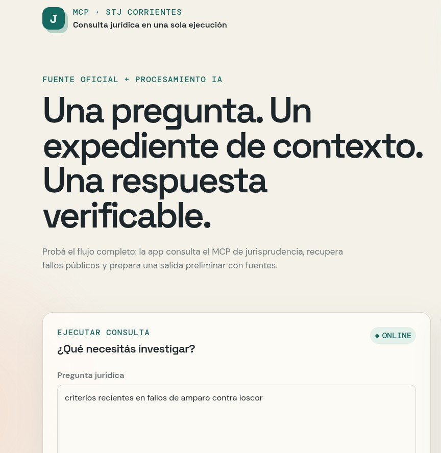

# Jurisprudencia MCP · Corrientes



MVP web para realizar consultas jurídicas one-shot sobre la jurisprudencia pública del Superior Tribunal de Justicia de Corrientes. La aplicación recibe una pregunta, busca fallos en el portal oficial mediante un MCP local, recupera el detalle y el texto de los PDFs, y genera una respuesta puntual o un reporte preliminar con OpenCode.

No es un chatbot persistente, no requiere autenticación y no pretende reemplazar el análisis profesional: cada salida debe contrastarse con el fallo original y la normativa vigente.

## Qué hace

- Consulta el buscador público de jurisprudencia del STJ de Corrientes.
- Traduce filtros habituales: texto, materia, año, tipo de fallo, legajo y categorías.
- Recupera hasta tres fallos, sus detalles HTML y sus PDFs.
- Extrae texto localmente con `pdftotext`.
- Sintetiza el contexto en español con un modelo gratuito de OpenCode.
- Ofrece dos salidas: respuesta puntual o reporte preliminar.
- Expone el MCP por JSON-RPC sobre stdio y una interfaz web sin auth.

## Flujo

```text
Pregunta web
    ↓
POST /api/query
    ↓
web-server → MCP JSON-RPC → portal oficial
                       ├─ búsqueda
                       ├─ detalle HTML
                       └─ PDF + extracción local
    ↓
OpenCode → respuesta verificable con fuentes
```

La IA no navega el portal ni inventa fuentes: recibe únicamente el contexto recuperado por el MCP. Si OpenCode no está disponible, el backend conserva un fallback local reproducible.

## Arranque con Docker Compose

Requisitos: Docker, Docker Compose y una sesión gráfica del host para el acceso CDP recomendado.

```bash
cp .env.example .env
DISPLAY=:0 ./scripts/start-host-chrome.sh
docker compose up -d --build
```

Abrir [http://localhost:3000](http://localhost:3000).

El arranque es manual y el servicio tiene `restart: "no"`: no se configura reinicio automático con Docker ni con el sistema. Para detenerlo:

```bash
docker compose down
systemctl --user stop mvp-jurisprudencia-chrome.service
```

## Acceso al portal y Cloudflare

El portal puede presentar un desafío de Cloudflare a clientes HTTP o a Chromium aislado. Por eso el Compose admite una sesión Chrome externa, iniciada manualmente y aislada del perfil personal:

```bash
DISPLAY=:0 ./scripts/start-host-chrome.sh
```

El script usa el puerto local `9222` y un perfil temporal en `/tmp/mvp-jurisprudencia-chrome-profile`. El MCP reutiliza una pestaña `page` por CDP y no cierra ese Chrome al detenerse.

La configuración recomendada en `.env` es:

```dotenv
JURIS_ACCESS_MODE=browser
JURIS_CDP_URL=http://127.0.0.1:9222
JURIS_CHALLENGE_TIMEOUT_MS=60000
```

Alternativas:

- `JURIS_ACCESS_MODE=auto`: intenta HTTP directo y luego Chromium + Xvfb.
- `JURIS_ACCESS_MODE=direct`: solo HTTP directo; útil si la red no presenta el desafío.
- `JURIS_ACCESS_MODE=browser`: usa CDP externo cuando `JURIS_CDP_URL` existe; si no, Chromium + Xvfb dentro del contenedor.

El diagnóstico está disponible en `GET /api/diagnose` y distingue el desafío HTTP de la disponibilidad de CDP.

## OpenCode

El contenedor instala el CLI `opencode-ai`. La configuración de ejemplo usa el modelo gratuito probado en el MVP:

```dotenv
OPENCODE_ENABLED=1
OPENCODE_MODEL=opencode/nemotron-3.5-lightning-free
```

También se puede configurar otro proveedor/modelo en `.env`. No se incluyen claves en el repositorio; `.env` está excluido por `.gitignore`.

## API web

### Health

```bash
curl http://localhost:3000/api/health
```

### Consulta one-shot

```bash
curl -X POST http://localhost:3000/api/query \
  -H 'content-type: application/json' \
  -d '{
    "question": "¿Qué criterios recientes aparecen sobre amparo contra IOSCOR?",
    "mode": "single",
    "filters": {"materias": ["Amparo"]}
  }'
```

El JSON de respuesta incluye `provider`, `model`, resultados, documentos considerados, texto extraído, enlaces oficiales y la síntesis IA.

## Herramientas MCP

- `search_jurisprudencia`: búsqueda con filtros nativos del portal.
- `get_jurisprudencia_detail`: detalle HTML estructurado por ID numérico.
- `get_jurisprudencia_pdf_text`: descarga y extracción local del PDF oficial.
- `diagnose_jurisprudencia_access`: diagnóstico de HTTP, Cloudflare y CDP.

Para usar el MCP desde otro cliente:

```json
{
  "mcpServers": {
    "jurisprudencia-corrientes": {
      "command": "node",
      "args": ["/ruta/absoluta/api-remota/src/server.mjs"]
    }
  }
}
```

En un entorno sin `DISPLAY`, puede usarse `xvfb-run` delante de `node` si no se dispone de un Chrome CDP externo.

## Ejemplos de búsqueda

El directorio [`screenshots/`](./screenshots/) contiene PDFs exportados desde la interfaz como ejemplos reproducibles del flujo completo. Para su publicación se incluyen copias con datos identificatorios cubiertos:

- [Ejemplo 1 · reporte sobre criterios de estafa](<./screenshots/censurados/ej 1 - Jurisprudencia · MVP MCP - 2026-08-29 - censurado.pdf>): búsqueda de fallos recientes sobre estafas.
- [Ejemplo 2 · reporte sobre amparo contra IOSCOR](<./screenshots/censurados/ej 2 - Jurisprudencia · MVP MCP - 2026-08-30 - censurado.pdf>): búsqueda filtrada por materia Amparo.
- [Ejemplo 3 · criterios jurisprudenciales en estafas](<./screenshots/censurados/ej 3 - Jurisprudencia · MVP MCP - 2026-08-30 - censurado.pdf>): otra consulta one-shot sobre estafas.

Los PDFs censurados son material de demostración: las copias publicables tienen barras negras sobre nombres de partes, profesionales, expedientes, identificadores y enlaces de fuentes. Los originales se conservan localmente para pruebas, pero quedan excluidos por `.gitignore`.

## Revisión previa para publicar en GitHub

Se revisó el contenido local antes de publicar:

- No se encontraron API keys, tokens, contraseñas, claves privadas, correos personales ni rutas absolutas del equipo.
- `.env` está excluido por `.gitignore`; `.env.example` solo contiene nombres y valores de ejemplo.
- `portada.png` es una conversión de la portada visual de la aplicación y no contiene información de cuenta.
- Los PDFs originales de `screenshots/` no contienen rutas locales ni credenciales, pero sí datos públicos identificatorios de causas judiciales y por eso no se publican.
- Las copias de `screenshots/censurados/` fueron rasterizadas y revisadas visualmente antes de incluirse.

## Desarrollo local

```bash
npm test
npm start
```

El servidor web escucha en `http://localhost:3000`. El MCP se ejecuta como un proceso hijo y el trabajo de consultas se serializa para evitar carreras en la sesión de navegador.

## Licencia y alcance

Este repositorio es un prototipo técnico. El contenido jurídico pertenece a sus fuentes oficiales y la aplicación no brinda asesoramiento jurídico definitivo.
